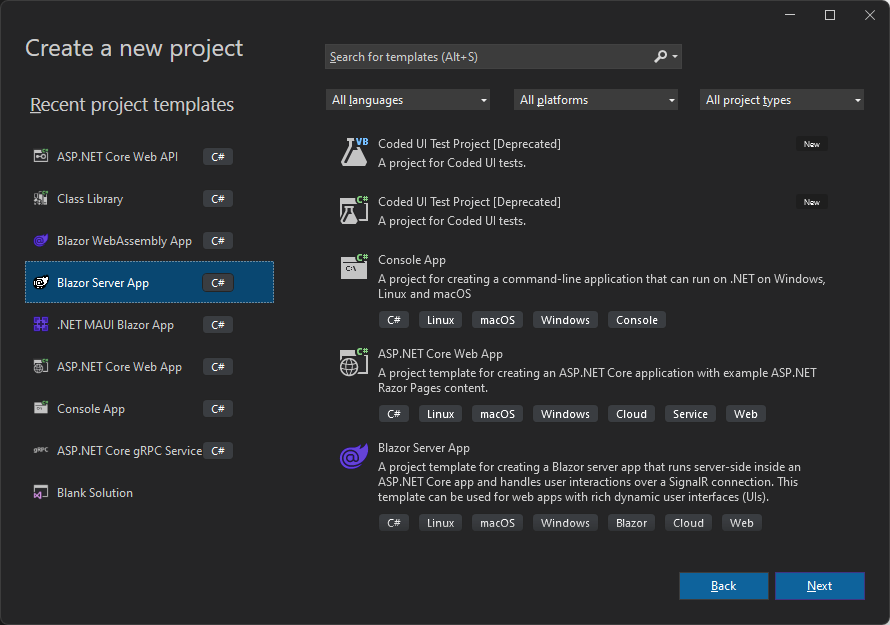
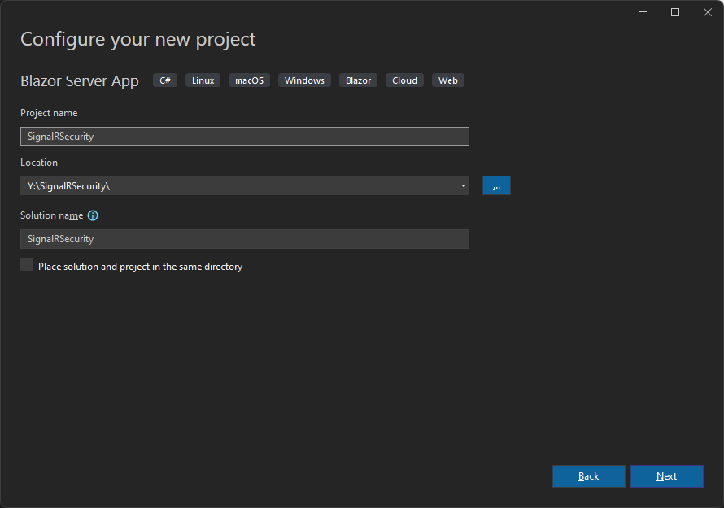
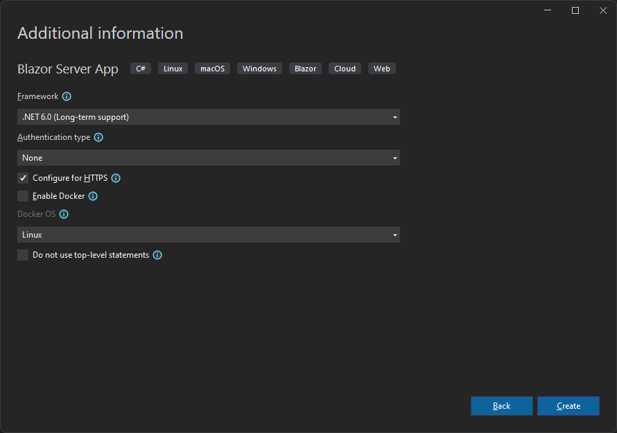
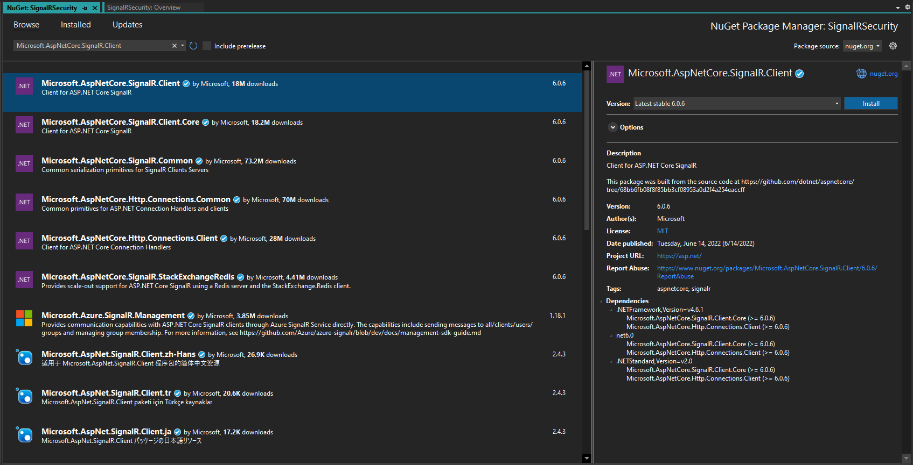

# Table of Contents

- [Table of Contents](#table-of-contents)
  - [Introduction](#introduction)
  - [Prerequisites](#prerequisites)
    - [.NET 6.0](#net-60)
    - [Visual Studio 2022 Preview](#visual-studio-2022-preview)
    - [Mobile Development with .NET Workload](#mobile-development-with-net-workload)
  - [Demo](#demo)
    - [Create a Blazor Server Application](#create-a-blazor-server-application)
    - [Authentication and Authorization in SignalR](#authentication-and-authorization-in-signalr)
  - [Summary](#summary)
  - [Complete Code](#complete-code)
  - [Resources](#resources)

## Introduction

In this episode, we are going to build a REPLACE_HERE.

End results will look like this:


Let's get to it.

## Prerequisites

The following prerequisites are needed for this demo.

### .NET 6.0

Download the latest version of the .NET 6.0 SDK [here](https://dotnet.microsoft.com/en-us/download).

>:blue_book: The demo below also applies to `ASP.NET Core` versions 3.0, 3.1, and 5.0, but we are using 6.0 for this demo.

### Visual Studio 2022 Preview

For this demo, we are going to use the latest version of [Visual Studio 2022 Preview](https://visualstudio.microsoft.com/vs/community/).

### Mobile Development with .NET Workload

In order to build Blazor apps, the ASP.NET and web development workload needs to be installed, so if you do not have that installed let's do that now.

  

## Demo

In the following demo we will create a REPLACE_HERE and I will show you REPLACE_HERE.

### Create a Blazor Server Application







Now let's add some quick `SignalR` chat sample code.

You can follow these instructions here [Use ASP.NET Core SignalR with Blazor](https://docs.microsoft.com/en-us/aspnet/core/blazor/tutorials/signalr-blazor?view=aspnetcore-7.0&tabs=visual-studio&pivots=server), and skip to [Authentication and Authorization in SignalR](#authentication-and-authorization-in-signalr), or follow along. The code below is basically the same code as the Microsoft sample, except with some minor UI changes.

Add a NuGet reference to `Microsoft.AspNetCore.SignalR.Client`.

  

Create a **Hubs** folder and add a **ChatHub.cs** file, with the following content:

```csharp
using Microsoft.AspNetCore.SignalR;

namespace BlazorServerSignalRApp.Server.Hubs
{
    public class ChatHub : Hub
    {
        public async Task SendMessage(string user, string message)
        {
            await Clients.All.SendAsync("ReceiveMessage", user, message);
        }
    }
}
```

Open the **Program.cs** file and replace the code with this:

```csharp
using Microsoft.AspNetCore.Components;
using Microsoft.AspNetCore.Components.Web;
using SignalRSecurity.Data;
using Microsoft.AspNetCore.ResponseCompression;
using BlazorServerSignalRApp.Server.Hubs;

var builder = WebApplication.CreateBuilder(args);

// Add services to the container.
builder.Services.AddRazorPages();
builder.Services.AddServerSideBlazor();
builder.Services.AddSingleton<WeatherForecastService>();
builder.Services.AddResponseCompression(opts =>
{
    opts.MimeTypes = ResponseCompressionDefaults.MimeTypes.Concat(
        new[] { "application/octet-stream" });
});

var app = builder.Build();

app.UseResponseCompression();

// Configure the HTTP request pipeline.
if (!app.Environment.IsDevelopment())
{
    app.UseExceptionHandler("/Error");
    // The default HSTS value is 30 days. You may want to change this for production scenarios, see https://aka.ms/aspnetcore-hsts.
    app.UseHsts();
}

app.UseHttpsRedirection();

app.UseStaticFiles();

app.UseRouting();

app.MapBlazorHub();
app.MapHub<ChatHub>("/chathub");
app.MapFallbackToPage("/_Host");

app.Run();
```

Finally, replace the contents of the **Pages/Index.razor** file with this:

```razor
@page "/"
@using Microsoft.AspNetCore.SignalR.Client
@inject NavigationManager NavigationManager
@implements IAsyncDisposable

<PageTitle>Index</PageTitle>

<style>
    ul.no-bullets {
        list-style-type: none;
        margin: 0;
        padding: 0;
    }
</style>

<div>
    <label>
        User
    </label>
</div>
<div>
    <input @bind="userInput" />
</div>
<div>
    <label>
        Message
    </label>
</div>
<div>
    <input @bind="messageInput" size="50" />
</div>
<br />

<button @onclick="Send" disabled="@(!IsConnected)">Send</button>
<hr>

<ul class="no-bullets" id="messagesList">
    @foreach (var message in messages)
    {
        <li>@message</li>
    }
</ul>

@code {
    private HubConnection? hubConnection;
    private List<string> messages = new List<string>();
    private string? userInput;
    private string? messageInput;

    protected override async Task OnInitializedAsync()
    {
        hubConnection = new HubConnectionBuilder()
            .WithUrl(NavigationManager.ToAbsoluteUri("/chathub"))
            .Build();

        hubConnection.On<string, string>("ReceiveMessage", (user, message) =>
        {
            var encodedMsg = $"{DateTime.UtcNow} {user}: {message}";
            messages.Add(encodedMsg);
            InvokeAsync(StateHasChanged);
        });

        await hubConnection.StartAsync();
    }

    private async Task Send()
    {
        if (hubConnection is not null)
        {
            await hubConnection.SendAsync("SendMessage", userInput, messageInput);
        }
    }

    public bool IsConnected => hubConnection?.State == HubConnectionState.Connected;

    public async ValueTask DisposeAsync()
    {
        if (hubConnection is not null)
        {
            await hubConnection.DisposeAsync();
        }
    }
}
```

### Authentication and Authorization in SignalR

## Summary

For more information about Blazor, check the links in the resources section below.

## Complete Code

The complete code for this demo can be found in the link below.

- <https://github.com/payini/SignalRSecurity>

## Resources

| Resource Title                                                                             | Url                                                                                                                                 |
| ------------------------------------------------------------------------------------------ | ----------------------------------------------------------------------------------------------------------------------------------- |
| The .NET Show with Carl Franklin                                                           | <https://www.youtube.com/playlist?list=PL8h4jt35t1wgW_PqzZ9USrHvvnk8JMQy_>                                                          |
| Download .NET                                                                              | <https://dotnet.microsoft.com/en-us/download>                                                                                       |
| Use ASP.NET Core SignalR with Blazor                                                       | <https://docs.microsoft.com/en-us/aspnet/core/blazor/tutorials/signalr-blazor?view=aspnetcore-7.0&tabs=visual-studio&pivots=server> |
| Overview of ASP.NET Core SignalR                                                           | <https://docs.microsoft.com/en-us/aspnet/core/signalr/introduction?view=aspnetcore-7.0>                                             |
| Authentication and authorization in ASP.NET Core SignalR                                   |
| <https://docs.microsoft.com/en-us/aspnet/core/signalr/authn-and-authz?view=aspnetcore-7.0> |
| Security considerations in ASP.NET Core SignalR                                            | <https://docs.microsoft.com/en-us/aspnet/core/signalr/security?view=aspnetcore-7.0>                                                 |